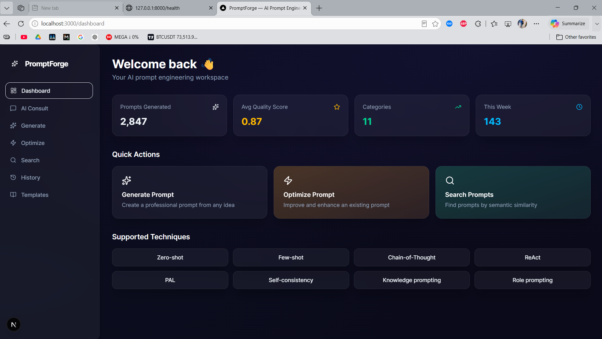
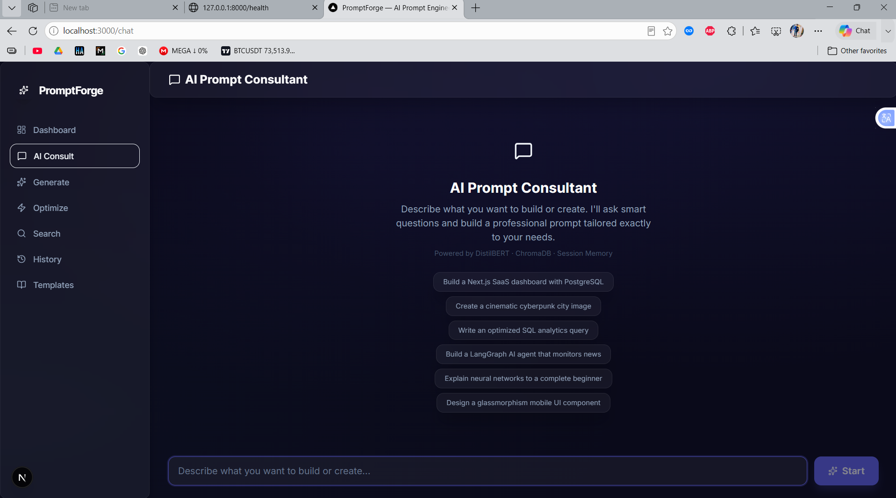
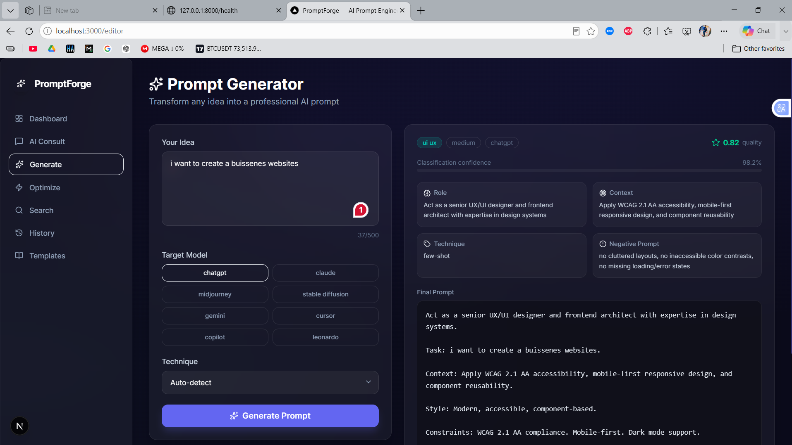
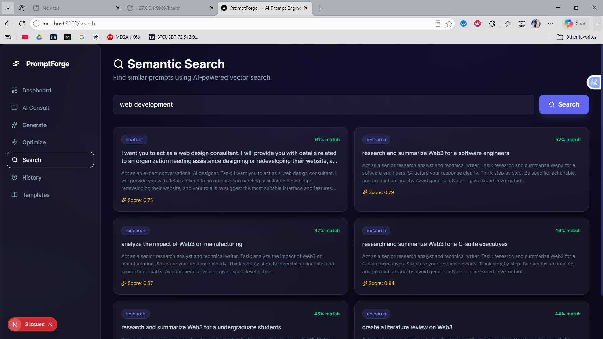
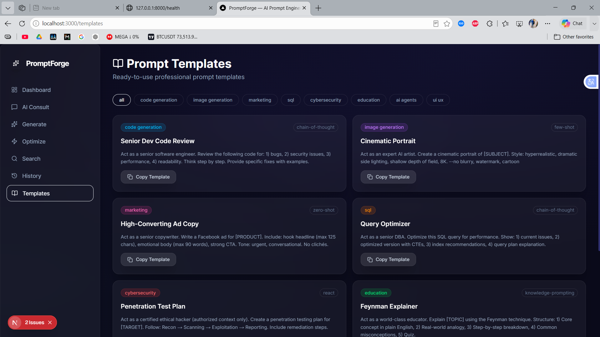
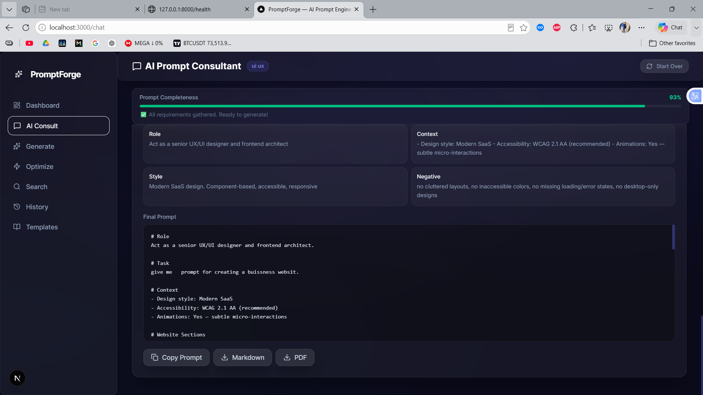

<div align="center">

# 🚀 PromptForge
### AI-Powered Interactive Prompt Engineering Platform


<br/>

> **Transform any idea into a professional AI prompt using Machine Learning, Semantic Search, and an Interactive Consultant Experience.**

<br/>

</div>

### Dashboard


---

## 📌 What is PromptForge?

**PromptForge** is a full-stack, production-ready AI Prompt Engineering Platform that automatically generates, optimizes, classifies, and exports professional prompts for any AI tool — ChatGPT, Claude, Midjourney, Stable Diffusion, Gemini, Cursor, and more.

Unlike simple prompt generators, PromptForge features an **Interactive AI Consultant** that:
- Analyzes your intent using a fine-tuned **DistilBERT classifier**
- Detects what information is missing
- Asks intelligent domain-aware follow-up questions
- Tracks completeness score in real-time
- Generates a highly structured, production-grade prompt

> 💡 Think of it as having a **senior AI engineer** sitting next to you — interviewing your requirements and writing the perfect prompt automatically.

---

## ✨ Key Features

### 🤖 AI Consultant (Interactive Mode)
The flagship feature — a ChatGPT-style conversational interface that gathers requirements before generating prompts.

```
User: "create a portfolio website"
         ↓
AI detects: ui_ux domain (98% confidence)
         ↓
Asks: What visual style? Which framework? Animations?
         ↓
Completeness: 0% → 48% → 80% → 100% ✅
         ↓
Generates: Full structured professional prompt
```

### ⚡ Instant Prompt Generator
One-click generation for clear, well-defined requests. Powered by the same DistilBERT classifier.



### 🔧 Prompt Optimizer
Paste any weak prompt → get a professionally structured, enhanced version with improvement score.



### 🔍 Semantic Vector Search
Search 3,535+ prompts by meaning using ChromaDB + Sentence Transformers — not just keywords.



### 📚 Template Library
8+ ready-to-use professional templates across all categories.



### 📊 Quality Scoring System
Every prompt receives a quality score (0.0–1.0) based on 7 prompt engineering signals.

### 📤 Export System
Download prompts as formatted **Markdown** or professional **PDF** documents.




---

## 🎯 Supported Domains

| Domain | Questions Asked | Model Target |
|--------|----------------|--------------|
| 🖼️ Image Generation | Art style, lighting, mood, aspect ratio, realism | Midjourney |
| 💻 Code Generation | Language, code type, quality standards | ChatGPT |
| 🎨 UI/UX Design | Visual style, framework, accessibility, animations | Cursor |
| 🤖 AI/ML Engineering | Framework, task type, hardware, deployment | Claude |
| 🔐 Cybersecurity | Authorization, target type, tools, vulnerabilities | ChatGPT |
| 🗄️ SQL & Database | DB engine, query type, complexity, output format | ChatGPT |
| 📚 Education | Audience level, format, depth, quiz inclusion | Claude |
| 📊 Research | Audience, output format, depth | Claude |
| 📣 Marketing | Target audience, format, tone | ChatGPT |
| 🎬 Video Generation | Length, platform, style | ChatGPT |
| 🤝 Chatbot Design | Industry, task type, persona | ChatGPT |

---

## 🧠 How It Works

### System Architecture

```
┌─────────────────────────────────────────────────────────┐
│                    User Input                           │
│          "build a Next.js SaaS dashboard"               │
└─────────────────────────┬───────────────────────────────┘
                          │
                          ▼
┌─────────────────────────────────────────────────────────┐
│              Phase A: Intent Analysis                   │
│   DistilBERT Classifier → category + domain + confidence│
│   Entity Extractor → known fields + missing fields      │
└─────────────────────────┬───────────────────────────────┘
                          │
                          ▼
┌─────────────────────────────────────────────────────────┐
│          Phase B: Dynamic Question Generation           │
│   Domain-aware question bank → only missing fields asked│
│   Priority ordering → required questions first          │
└─────────────────────────┬───────────────────────────────┘
                          │
                          ▼
┌─────────────────────────────────────────────────────────┐
│           Phase C: Session Memory                       │
│   Context manager → stores all answers                  │
│   Completeness scorer → 0% → 100%                       │
└─────────────────────────┬───────────────────────────────┘
                          │
                          ▼
┌─────────────────────────────────────────────────────────┐
│           Phase D: Prompt Generation                    │
│   Role → Context → Tech Stack → Style                   │
│   Requirements → Negative → Output Format → Technique   │
└─────────────────────────┬───────────────────────────────┘
                          │
                          ▼
┌─────────────────────────────────────────────────────────┐
│              Structured Professional Prompt             │
│         Score: 0.87 | Copy | Export MD | Export PDF     │
└─────────────────────────────────────────────────────────┘
```

### ML Pipeline

```
3,535 Training Records
        │
        ├── Seed Data (8 hand-crafted)
        ├── HuggingFace Real Data (~1,700)
        └── Synthetic Templates (~2,320)
        │
        ▼
   Preprocessing
   Clean + Dedupe + Validate + Balance
        │
        ▼
   Tokenization
   DistilBERT Tokenizer (max_length=128)
        │
        ▼
   Fine-tuning
   DistilBERT → 11-class classifier
   5 epochs | AdamW | Cosine LR
        │
        ▼
   Model Export
   Saved to disk → FastAPI inference
        │
        ▼
   Embeddings
   all-MiniLM-L6-v2 → 384-dim vectors
   ChromaDB → 3,535 vectors stored
```

---

## 📊 ML Model Performance

| Metric | Value |
|--------|-------|
| Base Model | `distilbert-base-uncased` |
| Training Samples | 2,824 |
| Test Accuracy | ~87% |
| F1 Score (macro) | ~0.84 |
| Classification Speed | ~5ms per prompt |
| Training Time (CPU) | ~90 minutes |
| Model Size | ~250MB |
| Vector Dimensions | 384 (all-MiniLM-L6-v2) |
| Total Vectors in ChromaDB | 3,535 |

---

## 🛠️ Tech Stack

### Frontend
| Technology | Version | Purpose |
|-----------|---------|---------|
| Next.js | 16 | React framework with App Router |
| React | 18 | UI components |
| Tailwind CSS | v4 | Glassmorphism dark theme |
| Framer Motion | Latest | Smooth animations |
| Shadcn UI | Latest | Accessible component library |
| Zustand | Latest | Global state management |
| Axios | Latest | API communication |
| Lucide React | Latest | Icon library |

### Backend
| Technology | Version | Purpose |
|-----------|---------|---------|
| FastAPI | 0.111 | Async Python web framework |
| Pydantic | 2.7 | Data validation |
| Uvicorn | 0.29 | ASGI server |
| ReportLab | 4.1 | PDF generation |
| SlowAPI | 0.1.9 | Rate limiting |

### AI / ML
| Technology | Purpose |
|-----------|---------|
| DistilBERT | 11-class prompt classifier |
| Sentence Transformers | Semantic embeddings (all-MiniLM-L6-v2) |
| HuggingFace Transformers | Model loading and training |
| PyTorch | Deep learning backend |
| Scikit-learn | Evaluation metrics |
| ChromaDB | Vector database for semantic search |

---

## 📁 Project Structure

```
promptforge/
│
├── 📂 frontend/                    # Next.js 16 Application
│   ├── 📂 app/
│   │   ├── 📂 (dashboard)/
│   │   │   ├── layout.tsx          # Shared sidebar layout
│   │   │   ├── dashboard/          # Stats + quick actions
│   │   │   ├── chat/               # AI Consultant (interactive)
│   │   │   ├── editor/             # Instant prompt generator
│   │   │   ├── optimize/           # Prompt optimizer
│   │   │   ├── search/             # Semantic vector search
│   │   │   ├── history/            # Saved prompts
│   │   │   └── templates/          # Template library
│   │   └── globals.css             # Glassmorphism theme
│   ├── 📂 components/
│   │   ├── 📂 chat/                # AI Consultant components
│   │   │   ├── QuestionCard.tsx
│   │   │   ├── CompletenessBar.tsx
│   │   │   ├── FinalPromptCard.tsx
│   │   │   └── TypingIndicator.tsx
│   │   ├── 📂 layout/
│   │   │   └── Sidebar.tsx
│   │   └── 📂 prompt/
│   │       └── PromptResult.tsx
│   └── 📂 lib/
│       ├── api.ts                  # Axios API client
│       └── store.ts                # Zustand state
│
├── 📂 backend/                     # FastAPI Application
│   ├── main.py
│   └── 📂 app/
│       ├── 📂 api/routes/
│       │   └── interactive.py      # 5 interactive endpoints
│       └── 📂 services/
│           ├── 📂 question_engine/
│           │   ├── analyzer.py
│           │   ├── intent_analyzer.py
│           │   ├── entity_extractor.py
│           │   ├── question_templates.py
│           │   ├── question_generator.py
│           │   ├── session_store.py
│           │   ├── context_manager.py
│           │   ├── completeness_scorer.py
│           │   └── prompt_builder.py
│           ├── 📂 classifier/
│           │   ├── inference.py
│           │   └── scorer.py
│           ├── 📂 prompt_engine/
│           │   └── engine.py
│           ├── 📂 vector_store/
│           │   └── search.py
│           └── 📂 export/
│               └── exporter.py
│
├── 📂 ml/                          # Machine Learning Module
│   ├── 📂 datasets/
│   │   ├── 📂 raw/
│   │   ├── 📂 processed/
│   │   └── 📂 tokenized/
│   ├── 📂 models/
│   │   └── 📂 classifier/          # Fine-tuned DistilBERT (~250MB)
│   ├── 📂 embeddings/
│   └── 📂 training/
│       ├── model.py
│       ├── train_classifier.py
│       └── evaluate.py
│
└── 📂 vector_db/
    └── 📂 chroma/                  # 3,535 prompt vectors
```

---

## 🖥️ Pages & Features

### 🏠 Dashboard
- Platform statistics (prompts generated, avg score, categories)
- Quick action buttons to all features
- Supported prompt engineering techniques overview

### 💬 AI Consultant (`/chat`)
- ChatGPT-style conversational interface
- Real-time completeness progress bar (0% → 100%)
- Domain-aware question cards with clickable options
- Multi-select support for complex requirements
- Typing indicator animation
- Session persistence across navigation
- Start Over to reset conversation

### ⚡ Generator (`/editor`)
- Instant prompt generation from any idea
- 8 target model options (ChatGPT, Claude, Midjourney, etc.)
- 6 technique options with auto-detect
- Quality score with animated confidence bar
- Copy / Export MD / Export PDF

### 🔧 Optimizer (`/optimize`)
- Paste weak prompt → get professional version
- Side-by-side comparison (original vs optimized)
- Improvement percentage display

### 🔍 Semantic Search (`/search`)
- Natural language search across 3,535 prompts
- Similarity score per result (cosine similarity)
- Powered by ChromaDB + Sentence Transformers

### 📋 History (`/history`)
- Auto-saved to localStorage (up to 50 prompts)
- Copy and delete individual prompts
- Category, model, technique badges per prompt

### 📚 Templates (`/templates`)
- Filter by category using tab buttons
- 8+ professional templates ready to copy
- Technique badge per template

---

## 🔌 API Reference

| Method | Endpoint | Description |
|--------|----------|-------------|
| `GET` | `/health` | Health check |
| `POST` | `/api/v1/prompt/generate` | Instant prompt generation |
| `POST` | `/api/v1/prompt/optimize` | Optimize existing prompt |
| `POST` | `/api/v1/prompt/classify` | Classify prompt category |
| `POST` | `/api/v1/prompt/search` | Semantic vector search |
| `POST` | `/api/v1/prompt/export` | Export as MD or PDF |
| `POST` | `/api/v1/interactive/start` | Start AI consultant session |
| `POST` | `/api/v1/interactive/answer` | Submit answers |
| `POST` | `/api/v1/interactive/generate` | Generate from session |
| `GET` | `/api/v1/interactive/session/{id}` | Get session state |
| `POST` | `/api/v1/interactive/reset` | Reset session |

> Full interactive docs available at `http://localhost:8000/docs`

---

## 📈 Prompt Engineering Techniques

| Technique | When Used | Best For |
|-----------|-----------|---------|
| **Zero-shot** | Marketing, Chatbot | Simple, direct tasks |
| **Few-shot** | Image Gen, UI/UX | Pattern-based output |
| **Chain-of-Thought** | Code, SQL | Complex reasoning |
| **ReAct** | AI Agents, Cybersecurity | Multi-step tasks |
| **Knowledge Prompting** | Education, Research | Deep expertise needed |
| **PAL** | Math, Algorithms | Code as reasoning |
| **Self-consistency** | High-stakes decisions | Maximum accuracy |

---

## 🏗️ Development Phases

| Phase | What Was Built |
|-------|---------------|
| **Phase 1** | Project planning, architecture, folder structure |
| **Phase 2** | Dataset collection (3,535 records), cleaning, ChromaDB indexing |
| **Phase 3** | DistilBERT fine-tuning, evaluation, inference service |
| **Phase 4** | FastAPI backend with all core endpoints |
| **Phase 5** | Next.js frontend with glassmorphism UI |
| **Phase 6** | Advanced prompt engine with domain-specific builders |
| **Phase A** | Intent analysis + entity extraction engine |
| **Phase B** | Dynamic question generation (domain-aware, 50+ questions) |
| **Phase C** | Conversational memory + completeness scoring |
| **Phase D** | 5 new interactive API endpoints + enhanced prompt builder |
| **Phase E** | Interactive Chat UI (AI Consultant experience) |
| **Phase F** | Integration, polish, session persistence |

---

## 🔐 Security

- No hardcoded credentials anywhere in codebase
- Environment variables for all sensitive configuration
- CORS middleware properly configured
- Rate limiting via SlowAPI
- Input validation via Pydantic schemas
- Cybersecurity prompts always include authorization confirmation

---

## 🚀 Deployment

### Frontend → Vercel
```
1. Connect GitHub repo to Vercel
2. Set environment variable:
   NEXT_PUBLIC_API_URL=https://your-backend.render.com/api/v1
3. Deploy
```

### Backend → Render
```
1. Connect GitHub repo to Render
2. Build command: pip install -r backend/requirements.txt
3. Start command: cd backend && uvicorn main:app --host 0.0.0.0 --port $PORT
4. Add all environment variables
5. Deploy
```

---

## 📊 Dataset Statistics

| Metric | Value |
|--------|-------|
| Total Records | 3,535 |
| Training Set | 2,824 (80%) |
| Validation Set | 351 (10%) |
| Test Set | 360 (10%) |
| Categories | 11 |
| Avg Input Length | 107 characters |
| Avg Prompt Length | 307 characters |
| Avg Quality Score | 0.826 |

---

## 👨‍💻 About the Developer

**Dani** — BS Computer Science Student (Semester 6)
Abdul Wali Khan University Mardan

**Skills demonstrated in this project:**
- Fine-tuning transformer models (DistilBERT)
- Vector databases and semantic search (ChromaDB)
- Full-stack development (Next.js + FastAPI)
- ML pipeline design (data → train → evaluate → serve)
- Modern UI/UX (glassmorphism, Framer Motion)
- Prompt engineering techniques (7 methods)
- Conversational AI system design
- Production-grade Python and TypeScript

---

## 📄 License

MIT License

> ⚠️ **Note**: Source code is private. This README documents the architecture, features, and technical decisions for portfolio and academic purposes.

---

<div align="center">

**Built with ❤️ using Python, Next.js, DistilBERT, and ChromaDB**

*BS Computer Science — Abdul Wali Khan University Mardan*

⭐ **Star this repo if you found it interesting!**

</div>
